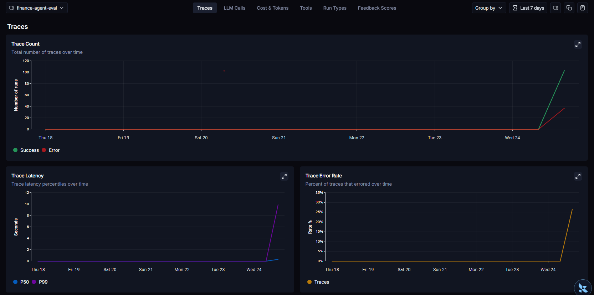
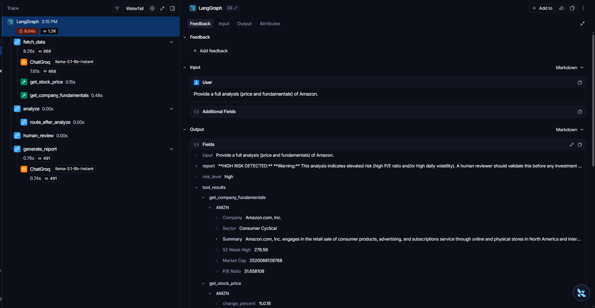
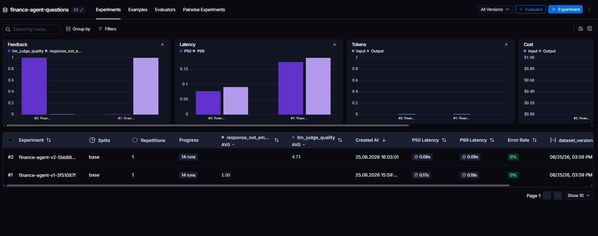
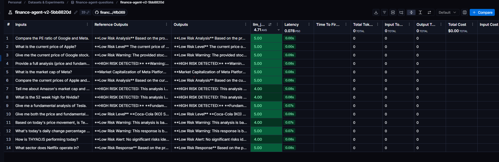

# 📈 AI Financial Analyst Agent

A real-time financial analysis agent powered by **Llama-3.3 (Groq)** and **Yahoo Finance**. The project includes two implementations of the same agent — a classic **LangChain tool-calling agent** (Streamlit app) and a **LangGraph state machine** — plus an automated **LLM-as-Judge evaluation** pipeline.

## 🚀 Features

* **Real-Time Data:** Fetches live stock prices and daily changes using `yfinance`.
* **Fundamental Analysis:** Retrieves key metrics like Market Cap, P/E Ratio, and Sector information.
* **Agentic Workflow:** The AI autonomously decides which tool to use based on the user's question (e.g., price lookup vs. company info).
* **LangGraph State Machine:** An explicit graph version of the agent with a risk-based routing step.
* **Automated Evaluation:** `eval.py` scores agent responses with a second LLM acting as a judge.
* **High Speed:** Powered by Groq's LPU inference engine for sub-second responses.

## 🛠️ Tech Stack

* **Brain:** Llama-3.3-70b-versatile (via Groq API)
* **Orchestration:** LangChain (Tool Calling Agent) + LangGraph (State Machine)
* **Data Source:** Yahoo Finance API
* **UI:** Streamlit
* **Language:** Python 3.10+

## 📂 Project Structure

```
.
├── app.py              # Streamlit UI + LangChain tool-calling agent (original)
├── langgraph_agent.py  # LangGraph state-machine version of the agent
├── eval.py             # LLM-as-Judge evaluation script
├── eval_results.csv    # Latest evaluation results (one row per test question)
├── requirements.txt
└── README.md
```

## 📦 Installation

1.  **Clone the repository:**
    ```bash
    git clone https://github.com/Mervecaliskann/langgraph-finance-agent-langsmith.git
    cd langgraph-finance-agent-langsmith
    ```

2.  **Install dependencies:**
    ```bash
    pip install -r requirements.txt
    ```

3.  **Set up environment variables:**
    Create a `.env` file and add your Groq API key:
    ```env
    GROQ_API_KEY=your_groq_api_key_here
    ```

4.  **Run the application:**
    ```bash
    streamlit run app.py
    ```

## 📂 Usage

1.  Enter a stock ticker or company name (e.g., "Apple", "THYAO.IS", "Tesla").
2.  Ask questions like:
    * *"What is the current price of Apple?"*
    * *"Give me a fundamental analysis of Microsoft."*
    * *"Compare the PE ratio of Google and Meta."*

---

## 🧠 LangGraph Agent (`langgraph_agent.py`)

Alongside the original LangChain agent, this repo includes a **LangGraph** implementation that makes the agent's reasoning steps explicit as a graph of nodes with a risk-based conditional branch:

```
fetch_data -> analyze ─┬─ (risk_level == "high") ─> human_review ─> generate_report -> END
                       └─ (risk_level == "low")  ───────────────────────────────────^
```

**Nodes:**

| Node | Description |
|---|---|
| `fetch_data` | The LLM decides which tool(s) — `get_stock_price`, `get_company_fundamentals` — to call for the ticker(s) mentioned in the question, then executes them and stores the raw results. |
| `analyze` | Computes a `risk_level` (`"high"` / `"low"`) from the fetched data: **high** if P/E ratio > 30 *or* `|daily change %|` > 3, otherwise **low**. |
| `human_review` | Only reached when `risk_level == "high"`. Currently a **placeholder** — it attaches a warning message recommending human review; it does not yet pause for real human approval. |
| `generate_report` | The LLM writes the final natural-language report using the fetched data, the risk level, and any warnings. |

**Conditional routing:** after `analyze`, the graph branches on `risk_level`:
- `"high"` → `human_review` → `generate_report`
- `"low"` → `generate_report` (directly)

Run it standalone:
```bash
python langgraph_agent.py "What is the price of Apple?"
```

## 🧪 Evaluation (`eval.py`)

`eval.py` runs a fixed set of **14 test questions** (price lookups, fundamentals, comparisons, "full analysis" requests, Turkish tickers, etc.) through the LangGraph agent and checks two things for each question:

1. **Tool selection accuracy** — does `fetch_data` call the *expected* tool(s) (`get_stock_price` and/or `get_company_fundamentals`) for that type of question?
2. **Response quality (LLM-as-Judge)** — a **separate, smaller Groq model** (`llama-3.1-8b-instant`) — different from the agent's `llama-3.3-70b-versatile` — rates each final report from 1–5 on:
   - **accuracy** — uses concrete data, no made-up numbers
   - **relevance** — directly answers the question asked
   - **clarity** — clear, concise, well-organized

All per-question results (question, expected vs. actual tools, risk level, judge scores + reasoning, full response) are written to `eval_results.csv`, and a summary is printed to the console.

### Latest Results

| Metric | Value |
|---|---|
| Tool selection accuracy | **100%** (14/14) |
| Average judge score (overall, 1–5) | **4.71** |

Run it:
```bash
python eval.py
```

## 📊 LangSmith Observability

Both the agent (`langgraph_agent.py`) and the eval pipeline (`eval.py`) are instrumented with **LangSmith** tracing, so every run — tool calls, intermediate state, and the final report — can be inspected in the LangSmith dashboard.




### Datasets & Experiments



---
*Developed by Merve Çalışkan*
